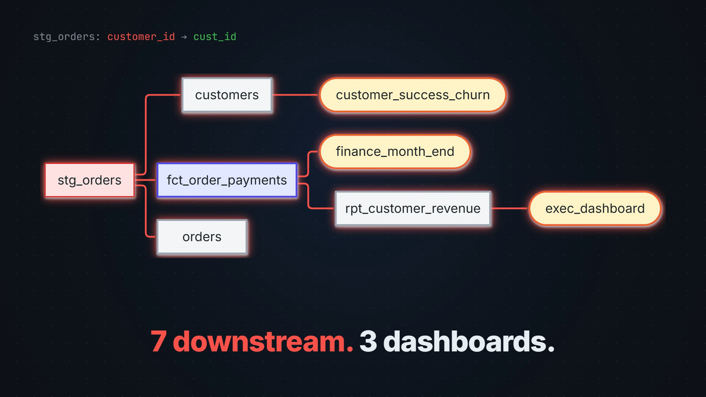

# dbt-sentinel

[](https://github.com/jashansadioura32/dbt-sentinel/actions/workflows/ci.yml)
[](pyproject.toml)
[](LICENSE)

**Blast-radius review for dbt pull requests.** dbt-sentinel maps a PR's diff to the dbt
models it changes, walks the dependency graph to see what they feed, and posts a review
with the severity, the affected models and dashboards, and a suggested fix. It fails the
check only when something downstream will actually break.

[](https://github.com/jashansadioura32/dbt-sentinel/raw/main/docs/assets/demo.mp4)

<p align="center"><a href="https://github.com/jashansadioura32/dbt-sentinel/raw/main/docs/assets/demo.mp4"><b>▶ Watch the 21-second demo (with sound)</b></a></p>

---

## The problem

Renaming a column in a staging model is one line in a diff, and it can break a dozen
models and the finance dashboard, because dbt doesn't rewrite references. The next run
fails, or worse, succeeds with wrong numbers. A reviewer sees one line; the consumers are
invisible without walking the DAG by hand, so in practice nobody does.

dbt-sentinel walks the DAG on every PR. The hard part isn't spotting a removed column,
it's deciding whether removing it *matters*, and that's where it's careful: the same
model with the same 7 downstream nodes gets **HIGH** for a column rename and **LOW** for a
comment.

## What it reports

| Section | Source | Fails the PR? |
|---|---|---|
| **Blast radius**: changed models, severity, downstream models, contracts and dashboards | Graph traversal over dbt's manifest | **Yes**, on HIGH |
| **Security**: exposed API keys, private keys, passwords in any added line of any file | Pattern matching | **Yes**, always |
| **Checks**: new model without docs, hardcoded `schema.table`, `= null` comparisons, and more | Pattern matching | No |
| **Reviewer findings**: governance rules and a SQL checklist (join keys, nulls, types, collation, grants) | LLM, optional | No |

Everything but the last row is deterministic: the same diff gives the same review, with
no API key needed.

---

## Quickstart

```bash
git clone https://github.com/jashansadioura32/dbt-sentinel.git
cd dbt-sentinel
python -m venv .venv && source .venv/bin/activate   # Windows: .venv\Scripts\activate
pip install -e ".[dev]"
```

The repo ships a real dbt manifest and 30 labelled diffs, so this works immediately:

```bash
python -m dbt_sentinel \
  --manifest evals/manifest/manifest.json \
  --diff evals/fixtures/b01_column_rename_with_consumers.diff \
  --fail-on high
```

```
## Blast radius

### 🔴 `stg_orders` — HIGH · 7 downstream
- Removed column(s) `customer_id` with 7 downstream node(s)
- Reaches 1 contracted model(s): fct_order_payments
- Reaches 3 exposure(s): customer_success_churn, finance_month_end, exec_dashboard
```

It exits 1, so it works as a CI gate. Swap in `p01_comment_added.diff` to see the same
model score LOW and exit 0.

### On your own dbt project

```bash
dbt parse                                  # writes target/manifest.json
dbt-sentinel --since origin/main           # review the current branch like its PR
```

### Three ways to run it

| | How | Guide |
|---|---|---|
| **GitHub App** | Reviews every PR, posts a comment and a commit status | [docs/DEPLOYMENT.md](docs/DEPLOYMENT.md) |
| **CI / CLI** | `dbt-sentinel --diff pr.diff --fail-on high` | below |
| **VS Code** | A post-commit hook reviews the branch and opens the result in the editor | [docs/LOCAL.md](docs/LOCAL.md) |

Optional extras: `pip install -e ".[agent]"` for the LLM reviewer (needs
`OPENAI_API_KEY`), `".[server]"` for the GitHub App.

**Windows:** if installing `openai` fails with `OSError: [Errno 2]`, the clone path is
too long for Windows' 260-character limit. Clone to a short path such as
`C:\src\dbt-sentinel`, or enable long paths.

### CLI reference

| Flag | Does |
|---|---|
| `--diff PATH` / `--since REF` | a unified diff file (`-` for stdin), or diff the branch against `REF` via git |
| `--manifest PATH` | dbt manifest (default `target/manifest.json`) |
| `--fail-on {high,medium,low,never}` | exit 1 at or above this severity (default `never`) |
| `--agent` | add LLM reviewer findings (needs `OPENAI_API_KEY`) |
| `--mermaid` | a blast-radius diagram per change |
| `--explain` | which policy rules were retrieved, with scores |
| `--changed-at ISO8601` | warn if the manifest predates the change |
| `--no-checks` | skip the lint checks ([docs/CHECKS.md](docs/CHECKS.md)) |

| Exit | Means |
|---|---|
| `0` | Reviewed; nothing at or above `--fail-on` |
| `1` | Reviewed; findings at or above `--fail-on`, or an exposed secret at any threshold |
| `2` | Couldn't run: unreadable manifest or diff, a bad argument, a git error |

The 1/2 split is deliberate: a pipeline that reports a missing manifest as a failed
review teaches people the tool cries wolf.

---

## How it works

```
diff ─► changed files ─► dbt models ─► BFS over child_map ─► severity
                                              │
            secrets + lint checks ◄───────────┤   deterministic
            policy retrieval      ◄───────────┘
                         │
                         ▼
            LLM reviewer (optional) ─► validated findings
                         │
                         ▼
            template render ─► PR comment + commit status
```

Four rules shape everything:

- **Deterministic first.** If graph traversal or string parsing can answer it, they do.
  The manifest ships the dependency graph; the LLM is for judgment, not lookup.
- **Reach amplifies risk; it doesn't create it.** Severity is triggered only by a
  structural change (a removed or renamed column, a deletion, a contract edit). Nearly
  every model is upstream of a dashboard, so a reviewer that flags on reach gets muted
  in a week.
- **The LLM never writes the comment.** It returns schema-validated findings; rendering
  is template code, so model output can't forge headings in someone's PR.
- **Degrade, don't crash.** No key, a timeout, invalid output: the review still posts,
  with a visible note that the agent didn't run.

Full walkthrough and the six design decisions (ADRs): [docs/ARCHITECTURE.md](docs/ARCHITECTURE.md).

---

## Results

Measured, not asserted. The labels were written from dbt semantics before the scorer
could run on them, and CI fails the build if any published number regresses.

**Severity** (30 labelled fixtures: 10 breaking, 10 should-pass, 10 subtle; real manifest
from dbt 1.12.4):

| Metric | First baseline | **Current** |
|---|---|---|
| Precision | 0.800 | **0.909** |
| Recall | 0.533 | **0.588** |
| False-positive rate on safe PRs | 0.200 | **0.000** |
| Fixtures silently dropped | 4 | **0** |

**Policy retrieval:** precision@3 0.636, recall@3 0.778.
**Lint checks and secret scanning:** precision 1.000, recall 1.000, and a false-positive
rate of 0.000 on 12 fixtures, and no unexpected finding on any of the 30 ordinary PRs
(two carry real, declared ones).

When it fires it's almost always right, and it still misses about 40% of what a careful
reviewer would catch. Every miss is in SQL semantics (join grain, an incremental
predicate, a dropped `distinct`), which no graph traversal reveals. That's the job of the
LLM reviewer, and its first measurement is honest: on the SQL checklist it scored
**precision 0.000** (analysis in [evals/SQL_POLICY_RESULTS.md](evals/SQL_POLICY_RESULTS.md)).
It's advisory for exactly that reason.

Details: [docs/EVAL_REPORT.md](docs/EVAL_REPORT.md) · [evals/RESULTS_V2.md](evals/RESULTS_V2.md) ·
label changes are argued in [evals/LABEL_CHANGES.md](evals/LABEL_CHANGES.md), never
silently edited.

```bash
python -m pytest tests/ -q               # 288 tests
python -m evals.runner                   # severity metrics
python -m evals.retrieval_eval           # retrieval precision/recall@3
python -m evals.checks_eval              # lint checks + secret scanning
python -m evals.sql_policy_eval          # LLM SQL checklist (needs OPENAI_API_KEY)
```

---

## Known limitations

| Limitation | Impact |
|---|---|
| Model-level lineage only | Reports that 7 models are downstream, not which of them select the dropped column |
| Column extraction is regex, not a parser | Misses `select *`, CTE aliases, macro-generated columns |
| A removed column in a shared `schema.yml` | No provable owner, so it's reported as an explicit medium uncertainty (the sole remaining false positive) |
| Macro changes | Warned, not resolved to the models that use them |
| Lexical retrieval | Can't match a paraphrase |
| Manifest assumed current | A stale manifest shrinks the blast radius; warned, not fixed |
| The policy pack isn't in the wheel | Install from a clone with `pip install -e`; a non-editable install warns that the agent ran without rules |

## What's next

- **Fix the glob gap in five governance rules.** `models/**/*.sql` doesn't match a model
  directly under `models/` in Python's `fnmatch`. The fix is measured (retrieval
  precision@3 0.636 → 0.647, recall@3 0.778 → 0.815) and ships with its docs update.
- **Iterate on the SQL checklist**, whose three failure modes are named in
  [evals/SQL_POLICY_RESULTS.md](evals/SQL_POLICY_RESULTS.md), and re-measure over several
  runs.
- **Log the agent's tool calls in the eval harnesses**, the first thing that analysis
  needs.
- **Column-level lineage** with a real SQL parser: the largest precision win available.
- **Macro-to-model resolution** from the manifest's `depends_on.macros`.

## Non-goals

No web UI (PR comments are the surface), no data catalog or lineage browser, no
multi-warehouse support (Snowflake-flavoured SQL), no agent framework that hides control
flow.

---

## Documentation

| Document | Covers |
|---|---|
| [docs/ARCHITECTURE.md](docs/ARCHITECTURE.md) | How it works, module map, and six ADRs with the rejected alternatives |
| [docs/CHECKS.md](docs/CHECKS.md) | The lint checks and secret scanning, with each one's false-positive contract |
| [docs/EVAL_REPORT.md](docs/EVAL_REPORT.md) | Methodology, metrics, failure taxonomy |
| [docs/DEPLOYMENT.md](docs/DEPLOYMENT.md) | GitHub App setup, permissions, secrets, troubleshooting, and what the first deploy found |
| [docs/LOCAL.md](docs/LOCAL.md) | Review on every commit in VS Code |
| [docs/PRD.md](docs/PRD.md) | Problem, users, success metrics against actuals |
| [docs/CASE_STUDY.md](docs/CASE_STUDY.md) | The build as a narrative: decisions, defects found, what I'd redo |

## Contributing

See [CONTRIBUTING.md](CONTRIBUTING.md). The short version: every bug becomes a regression
test, and eval labels are written before the code they measure.

## License

MIT. See [LICENSE](LICENSE).
